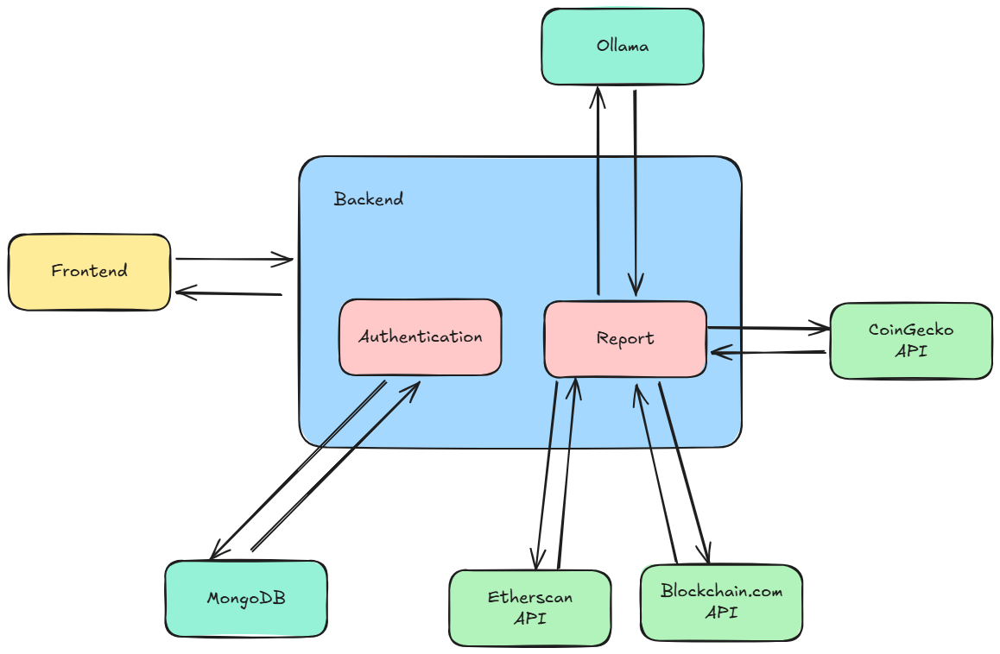

# 💰 Banker Expert – Personal Financial Intelligence

🎯 **Project Purpose**  
This project aims to provide a personalized financial assistant that analyzes user data and delivers comprehensive reports — as if written by a private banker and senior accountant.

⚙️ **Tech Stack**  
- **Backend:** Node.js (Express)  
- **Authentication Service:** MongoDB  
- **AI Engine:** Tinyllama  
- **Crypto Wallet Integration:** CoinGecko API 
- **Testing:** Jest  
- **Frontend:** React

🧩 **Architecture Overview**  
The system uses a modular monolith architecture — clear separation of services without microservices overhead:



✅ **Current Features**  
- 🟢 Base Express server running  
- 🟢 Modular services
- 🟢 Project is structured for clarity, testing, and growth  
- 🟢 Crypto wallet connection and analysis
- 🟢 AI-generated financial reports

🔜 **Coming Soon**  
  
- Full frontend interface (React)    
- Full authentication flow with JWT  

## ⚙️ Installation & Setup

### 📦 Prerequisites 
- Node.js 
- Git for version control  

### 🔄 Clone the Repository
```bash
git clone 
```

### 🚀 Run the project

**Install dependencies:**
```bash
npm install
```

**Start the server:**
```bash
npm run dev
```

backend/   ← Express + MongoDB API
frontend/  ← React single page app
```

Each project keeps its own dependencies, environment variables, and deployment pipeline so you can host them separately.

### 🛠️ Backend setup
1. Install dependencies:
   ```bash
   cd backend
   npm install
   ```
2. Copy the example environment file and fill in the secrets:
   ```bash
   cp .env.example .env
   ```
   | Variable | Description |
   | --- | --- |
   | `PORT` | (Optional) HTTP port for the API. Defaults to `8000`. |
   | `MONGO_URI` | MongoDB connection string (Atlas or self-hosted). |
   | `JWT_SECRET` | Random string used to sign JSON Web Tokens. |
   | `MORALIS_API_KEY` | Moralis Web3 API key for wallet data. |
   | `CORS_ALLOWED_ORIGINS` | (Optional) Comma separated list of allowed origins for CORS, e.g. `http://localhost:3000
3. Start the server:
   ```bash
   npm run dev   # uses nodemon for live reload

## 📡 API Endpoints

| Method | Endpoint      | Description                           |
|--------|---------------|---------------------------------------|
| POST   | /auth/login   | Authenticate a user                   |
| POST   | /auth/register| Register a user                       |
| POST   | /full-report  | Get personalized report               |


## 📄 License
MIT License


